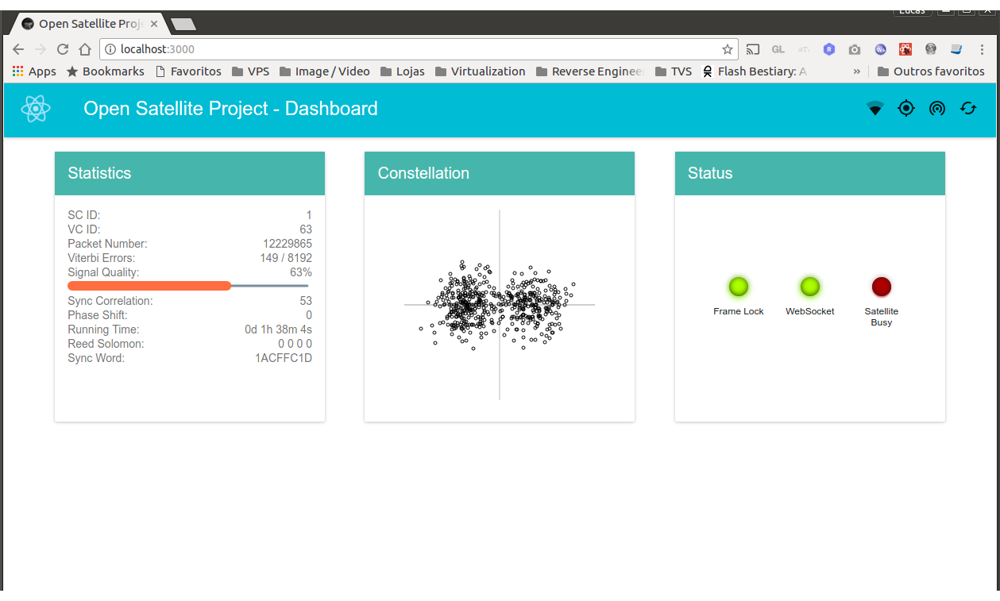

GOES LRIT Dumper
=========================

This program receives a TCP Stream from decoder and decodes the channel in realtime generating .lrit files. It also depends on **decompressor.exe** and will run wine to decompress the lrit files.

With all **LRIT** files, you can use [xrit2pic](http://www.alblas.demon.nl/wsat/software/soft_msg.html).

